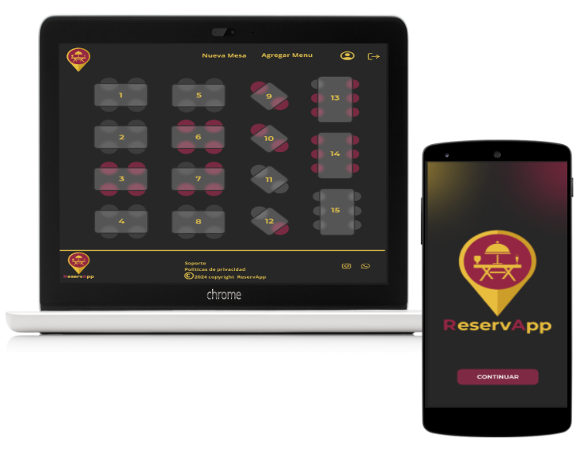
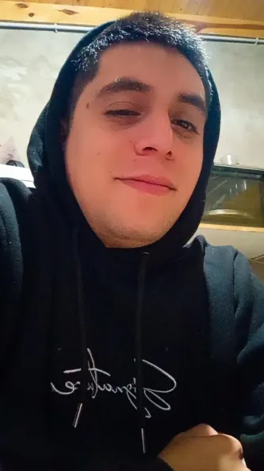
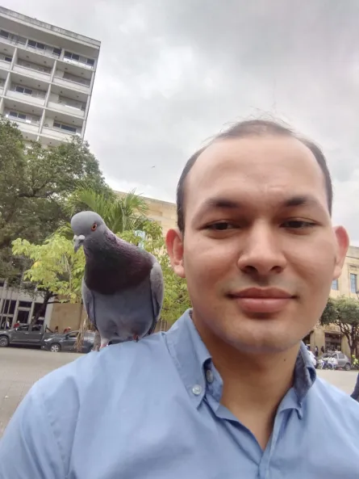
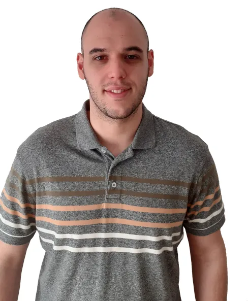
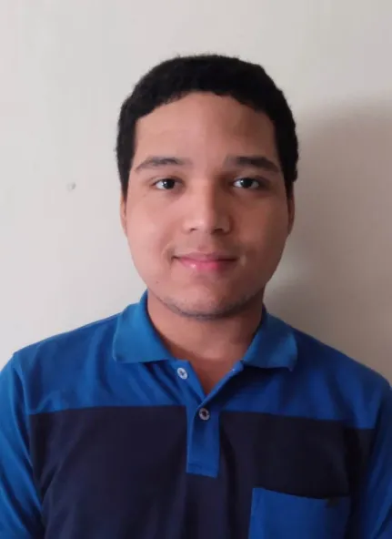

# s16-05-m-php-react

 

 
<h2>¿Qué esperás para reservar? </h2>
  
### ReserveApp está pensado como una aplicación que le permita a los usuarios poder reservar mesa, de un restaurante de una manera ágil y cómoda, desde su casa o trabajo.

  

Este proyecto está dirigido a:

<li>Clientes: Personas comensales, que quieren reservar con anticipación 1 o más mesas en un restaurante, de manera ágil desde la app.</li>
<li>Dueño del restaurante: Quien tendrá la posibilidad de utilizar la app, como usuario administrador, mediante un login, que le dará acceso a las funcionalidades principales.</li>

  
Características Principales

<li>Vista de las mesas: Navegación por un extenso catálogo de productos de merchandising de diversas franquicias y consolas.</li>
<li>Vista del menu: Filtros avanzados por franquicia, consola, género de videojuego, y plataforma de PC para facilitar la búsqueda de productos.</li>
<li>Carrito de Compras: Funcionalidad para agregar productos al carrito y proceder con una compra segura.</li>
<li>Gestión de Usuarios: Registro y autenticación de usuarios con roles de administrador y cliente.</li>
<li>Gestión de Pedidos: Creación y seguimiento de pedidos con detalles completos de la orden.</li>
<li>Interfaz Amigable: Diseño intuitivo y responsive para una experiencia de usuario óptima en todos los dispositivos.</li>

  
   
  
  
   
  
   
  
   
  
  

  <h3 align="center"><b>Puedes visitar nuestra página web aquí:</b></h3>
  <h3 align="center"></h3>
  

 

  

## ✔ Project Manager

#### 👉🏻 Lista de Tareas ✅

#### 👉🏻 Construida con 🛠️

| | 
|:-:|
| **Alan Rojas**|
|  
|
|  |

  
## ✔ BackEnd

#### 👉🏻 Lista de Tareas ✅

- Desarrollo de una API REST con PHP y Symfony.
- Crear una base de datos MySQL en Railway.
- Desplegar la API en Railway.
- Validación de usuarios con JWT construido y firmado en la aplicación.
- Documentación de la API en Swagger3.
- Puntos finales (endpoints) y servicios completamente probados.

#### 👉🏻 Documentación 📜

- Puedes leer la documentación de la API: <a href="https://energetic-hope-production.up.railway.app/swagger-ui/index.html" target="_blank">Aqui</a>.

#### 👉🏻 Construida con 🛠️

 

#### 👉🏻 Desarrolladores 👨🏻‍💻

| 
| 
| | 
|:-:|:-:|:-:| 
| **Juan Camilo García Gómez**| **Nicolás Galarza**| **Sebastián Laverde**| 
|  
|  
|  
| 
|  
|  
|  | 

  

## ✔ FrontEnd

#### 👉🏻 Lista de Tareas ✅

- Desarrollo de una aplicación front-end con React.
- Implementación de arquitectura de seguridad con interceptores JWT.
- Conexión con una API REST.
- Despliegue de front-end en Vercel.

#### 👉🏻 Construido con 🛠️

#### 👉🏻 Desarrolladores 👨🏻‍💻

| |
| |
|:-:|:-:|
| **Pablo Nudenberg**| **Sergio Gutierrez Padilla**|
|  
| |
|  
|  |
 

## ✔ Testing 

#### 👉🏻 Documentación 📜

- Puedes leer la documentación: <a href="https://virginiadanitz-1715966829669.atlassian.net/jira/software/projects/EC/boards/2" target="_blank">Aqui</a>.

#### 👉🏻 Lista de Tareas ✅

- Testing de los endpoints de la API REST, con Postman.
- Informe de testing api con Newman Postman.
- Diseño y ejecución de test cases con Planilla excel en Google drive.
- Reporte de Bugs con documento word, en Google Drive.

#### 👉🏻 Testeado con 🛠️

#### 👉🏻 Testers 👨🏻‍💻

| |
|:-:|
| **Virginia Danitz**|/
|  |
|  |
 

## ✔ UX/UI Design

#### 👉🏻 Lista de Tareas ✅

- Diseño de la identidad de marca y logotipos.
- Creación de prototipos y mockups de baja calidad.
- Definición de colores, fuentes y estilos.
- Avanzar hacia prototipos de calidad media y desarrollo de componentes.
- Redacción de textos y copywriting.
- Creación del Readme.md

#### 👉🏻 Construido con 🛠️

#### 👉🏻 Diseñadora 👨🏻‍💻

| |
|:-:|
| **Marianela Cortina**|
|  |
|  |

 

#### 👉🏻 Metodología de Desarrollo 🤝
- La duración de cada sprint es de una semana.
- Se realizan dos reuniones obligatorias con el líder del equipo por cada sprint.
- La reunión diaria tiene una duración máxima de 15 minutos.
- No se permiten tareas sin una épica asociada.
- Las épicas deben estar respaldadas por historias de usuario.
- Las tareas se asignan de acuerdo a su estimación.

#### 👉🏻 Herramientas utilizadas 🛠️

  

