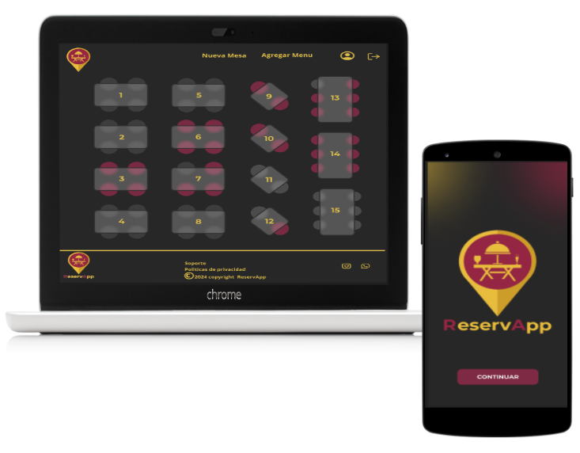
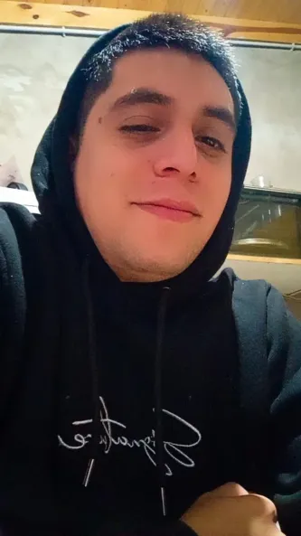
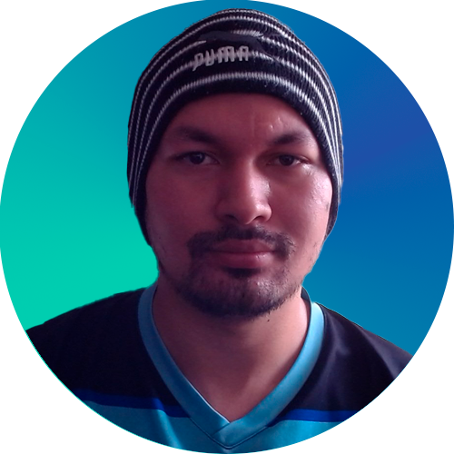
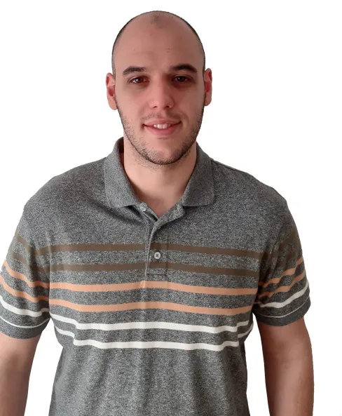
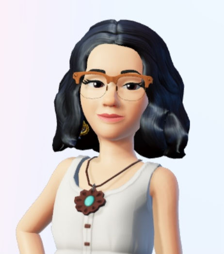

# s16-05-m-php-react

 

 
<h2>¿Qué esperas para reservar? </h2>
  
### ReservApp está pensado como una aplicación que le permita a los usuarios poder reservar mesa, de un restaurante de una manera ágil y cómoda, desde su casa o trabajo.

  

Este proyecto está dirigido a:

<li>Clientes: Personas comensales, que quieren reservar con anticipación 1 o más mesas en un restaurante, de manera ágil desde la app.</li>
<li>Dueño del restaurante: Quien tendrá la posibilidad de utilizar la app, como usuario administrador, mediante un login, que le dará acceso a las funcionalidades principales.</li>

  
Características Principales de la App:

<li>Reservar una mesa: El usuario-cliente de ReservApp, podrá acceder a la vista de las mesas disponibles del restaurante, seleccionar la mesa deseada, luego completar un formulario de datos (Fecha y horario de reserva, cantidad de comensales y algunos datos personales). Luego será llevado a una vista de confirmación y al presionar el botón Reservar, se le mostrará una vista con el resumen de su reserva.</li>
<li>Ver menú de comidas: En esta vista - que es solo a modo informativa - se le presentará el menú del restaurante, en forma de categorías y también podrá seleccionar cada una de ellas, para ver los platos disponibles.</li>
<li>Consultar mi reserva: Esta funcionalidad le permitirá acceder, al usuario-cliente, a su reserva, mediante el código de reserva.</li>
<li>Interfaz Amigable: Diseño intuitivo y responsivo para una experiencia de usuario óptima en todos los dispositivos.</li>

  
Características Principales para el Dueño del restaurante:

<li>Login: El dueño del restaurante tendrá acceso como usuario-admin a ReservApp, mediante correo electrónico y contraseña.</li>
<li>Home: El usuario-admin tendrá acceso a la vista Home, en donde podrá ver las mesas de su restaurante y el estado de cada una. También en el navbar tiene 2 botones, uno para ver las reservas y otro para ver el menu</li>
<li>ABM Mesa: El usuario-admin, podrá agregar, modificar, y eliminar una mesa.</li>
<li>ABM Menú: El usuario-admin, podrá agregar, modificar, y eliminar el menu, ya sea una categoría o un plato.</li>
<li>Gestión de Reservas: Podrá visualizar un listado de cada mesa, con su estado, fecha y horario de reserva, código, nombre del cliente que realizó la reserva y sus datos de contacto, por cualquier eventualidad.</li>

 

 

  
   
  
  <h3 align="center"><b>Puedes acceder a la vista de administrador con las siguientes credenciales</b></h3>
  
<b>Email: </b>admin@reservapp.com

  
<b>Password: </b>12345678

 

  
   
  
  <h3 align="center"><b>Puedes visitar nuestra página web aquí:</b></h3>
  <h3 align="center"><a href="https://develop--reserv-app.netlify.app/">ReservApp vista cliente</a></h3>
  <h3 align="center"><a href="https://develop--reserv-app.netlify.app/admin">ReservApp vista administrador</a></h3>
  

 

  

## ✔ Project Manager

#### 👉🏻 Lista de Tareas ✅

- Planificación y definición del proyecto.
- Seguimiento del progreso y gestión de tareas, utilizando Jira.
- Gestión de recursos y asignación de trabajo a cada integrante del equipo.
- Gestión de cada Sprint y backlog.
- Comunicación mediante daily's y colaboración con cada área.

#### 👉🏻 Herramientas utilizadas 🛠️

| |
|:-:|
| **Alan Rojas**|
|  |
|  |

  
## ✔ BackEnd

#### 👉🏻 Lista de Tareas ✅

- Desarrollo de las APIS REST con PHP y Symfony.
- Esquema de la base de datos utilizando MySQL.
- Autenticación mediante JWT.
- Protección de endpoints.
- CRUD y validación de reservas, mesas, productos y categorías.
- Validaciones especiales para las reservas, para evitar que se reserve una misma mesa, en una misma fecha y horario.
- Generación de código único para cada reserva.
- Consulta de disponibilidad horaria (en una fecha dada) de una mesa.
- Almacenamiento de imágenes.
- Sistema de recuperación de contraseña.
- Deploy en Render.

#### 👉🏻 Construida con 🛠️

 

#### 👉🏻 Desarrolladores 👨🏻‍💻

| ||
|:-:|:-:|
| **Juan Camilo** **García Gómez**| **Nicolás Galarza**|
|  | |
|  |  |

  

## ✔ FrontEnd

#### 👉🏻 Lista de Tareas ✅

- Desarrollo de una aplicación front-end con React.
- Manejo de estados con Zustand.
- Conexión con una API REST mediante Axios.
- Despliegue de la aplicación en Vercel.

#### 👉🏻 Construido con 🛠️

#### 👉🏻 Desarrolladores 👨🏻‍💻

| ||
|:-:|:-:|
| **Pablo Nudenberg**| **Sergio Gutierrez Padilla**|
|  | |
|  |  |
 

## ✔ Testing 

#### 👉🏻 Documentación 📜

- Puedes leer la documentación: <a href="https://drive.google.com/drive/folders/1zZocsdeiY-9NyyOelT8XBIRHJ_ixEz2t?usp=drive_link" target="_blank">Aquí</a>.

#### 👉🏻 Lista de Tareas ✅

- Testing de los endpoints de la API REST, con Postman.
- Informe de testing api con Newman Postman.
- Diseño y ejecución de test cases con Planilla excel en Google drive.
- Reporte de Bugs con documento word, en Google Drive.

#### 👉🏻 Testeado con 🛠️

#### 👉🏻 Testers 👨🏻‍💻

| |
|:-:|
| **Virginia Danitz**|/
|  |
|  |
 

## ✔ UX/UI Design

#### 👉🏻 Lista de Tareas ✅

- Diseño de la identidad de marca y logotipos.
- Creación de prototipos y mockups de baja calidad.
- Definición de colores, fuentes y estilos.
- Avanzar hacia prototipos de calidad media y desarrollo de componentes.
- Redacción de textos y copywriting.
- Creación del Readme.md

#### 👉🏻 Prototipo 📽️

- Puedes ver el prototipo: <a href="https://www.figma.com/proto/h15w4nTzOcqvHJFHFY7Wgv/s16-05-php-react?page-id=0%3A1&node-id=327-487&starting-point-node-id=307%3A432&t=nYHVlBGiTvAzuWxY-1" target="_blank">Aquí</a>.

#### 👉🏻 Construido con 🛠️

#### 👉🏻 Diseñadora 👨🏻‍💻

| |
|:-:|
| **Marianela Cortina**|
|  |
|  |

 

#### 👉🏻 Metodología de Desarrollo 🤝
- La duración de cada sprint es de una semana.
- Se realizan dos reuniones obligatorias con el líder del equipo por cada sprint.
- La reunión diaria tiene una duración máxima de 15 minutos.
- No se permiten tareas sin una épica asociada.
- Las épicas deben estar respaldadas por historias de usuario.
- Las tareas se asignan de acuerdo a su estimación.

#### 👉🏻 Herramientas utilizadas 🛠️

  

